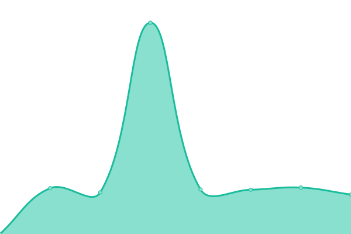
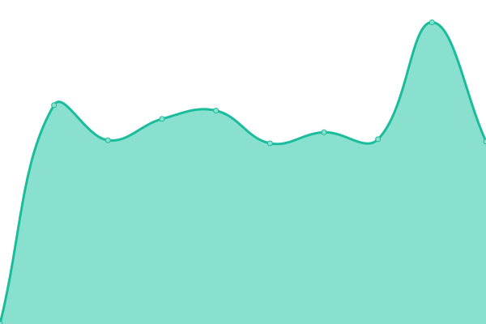

# [📈 Live Status](https://URE-IT.github.io/upptime): <!--live status--> **🟩 All systems operational**

This repository contains the open-source uptime monitor and status page for [Unión de Radioaficionados Españoles](https://www.ure.es), powered by [Upptime](https://github.com/upptime/upptime).

With [Upptime](https://upptime.js.org), you can get your own unlimited and free uptime monitor and status page, powered entirely by a GitHub repository. We use [Issues](https://github.com/URE-IT/upptime/issues) as incident reports, [Actions](https://github.com/URE-IT/upptime/actions) as uptime monitors, and [Pages](https://URE-IT.github.io/upptime) for the status page.

<!--start: status pages-->
<!-- This summary is generated by Upptime (https://github.com/upptime/upptime) -->
<!-- Do not edit this manually, your changes will be overwritten -->
<!-- prettier-ignore -->
| URL | Status | History | Response Time | Uptime |
| --- | ------ | ------- | ------------- | ------ |
|  [URE.es](https://www.ure.es) | 🟩 Up | [ure-es.yml](https://github.com/URE-IT/upptime/commits/HEAD/history/ure-es.yml) | 

 1932ms
     
 | 

<a href="https://URE-IT.github.io/upptime/history/ure-es">100.00%</a>
    

|  [Tienda](https://tienda.ure.es) | 🟩 Up | [tienda.yml](https://github.com/URE-IT/upptime/commits/HEAD/history/tienda.yml) | 

 1375ms
     
 | 

<a href="https://URE-IT.github.io/upptime/history/tienda">100.00%</a>
    

|  [WebCluster](https://webcluster.ure.es) | 🟩 Up | [web-cluster.yml](https://github.com/URE-IT/upptime/commits/HEAD/history/web-cluster.yml) | 

 2390ms
     
 | 

<a href="https://URE-IT.github.io/upptime/history/web-cluster">100.00%</a>
    

|  [GDURE](https://diplomas.ure.es) | 🟩 Up | [gdure.yml](https://github.com/URE-IT/upptime/commits/HEAD/history/gdure.yml) | 

 2369ms
     
 | 

<a href="https://URE-IT.github.io/upptime/history/gdure">99.82%</a>
    

|  [Concursos](https://concursos.ure.es) | 🟩 Up | [concursos.yml](https://github.com/URE-IT/upptime/commits/HEAD/history/concursos.yml) | 

 2640ms
     
 | 

<a href="https://URE-IT.github.io/upptime/history/concursos">99.30%</a>
    

|  [QDURE](https://qsl.ure.es) | 🟩 Up | [qdure.yml](https://github.com/URE-IT/upptime/commits/HEAD/history/qdure.yml) | 

 5349ms
     
 | 

<a href="https://URE-IT.github.io/upptime/history/qdure">100.00%</a>
    

|  [Formación](https://formacion.ure.es) | 🟩 Up | [formacion.yml](https://github.com/URE-IT/upptime/commits/HEAD/history/formacion.yml) | 

 739ms
     
 | 

<a href="https://URE-IT.github.io/upptime/history/formacion">99.80%</a>
    

<!--end: status pages-->

[**Visit our status website →**](https://URE-IT.github.io/upptime)

## 📄 License

- Powered by: [Upptime](https://github.com/upptime/upptime)
- Code: [MIT](./LICENSE) © [Unión de Radioaficionados Españoles](https://www.ure.es)
- Data in the `./history` directory: [Open Database License](https://opendatacommons.org/licenses/odbl/1-0/)
